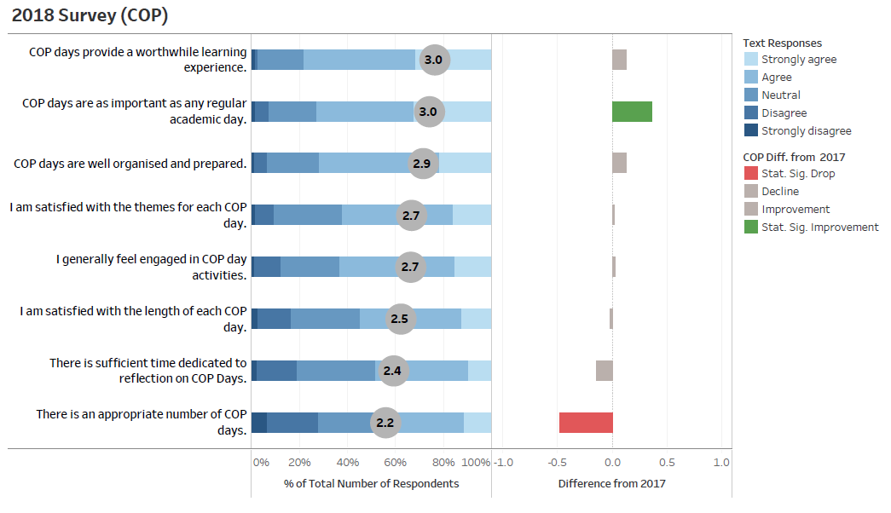

# tableau-viz
 An interactive visualization of likert-scale survey data incorporating response percentages and averages, and hypothesis testing identifying significant differences from previous responses

## Summary
For this project, I used Tableau Prep, Tableau Desktop, and Microsoft Excel, to produce a written but mostly visual report of data visualizations and analysis of student surveys. My aim was to make the visualizations understandable and appealing to members of staff and students, yet statistically sound and informed by quantitative evidence. 

These were visualisations of responses to likert-style, multiple choice, and open ended questions that had to do with student welfare, academics, and administration. Because the results are confidential, I have highlighted and summarized my work and results in displayed visualizations have been altered.

After processing survey responses in Excel, I grouped, filtered, and displayed results in Tableau as needed to create visualizations. Rather than only graphing Likert-scale responses, I also visualized results of hypothesis testing, including the magnitude and significance of differences  between year-groups, gender, self-identified cultural groups, and over time between 2017 and 2018 for each question, in order to achieve my aim of ensuring statistically informed visualizations. Additionally, I identified patterns and correlation over time within analysis of multiple student demographic subsets.

* Here is an example screenshot of a likert-scale visualization of survey results incorporating hypothesis testing. Interactive version will be uploaded in the near future."
